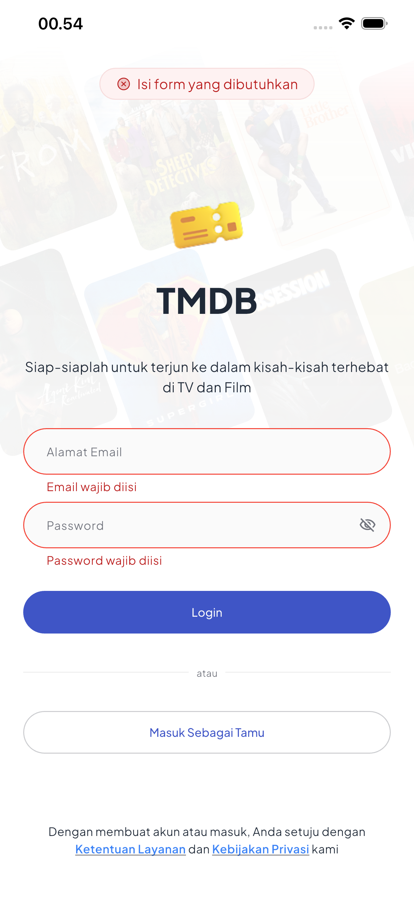
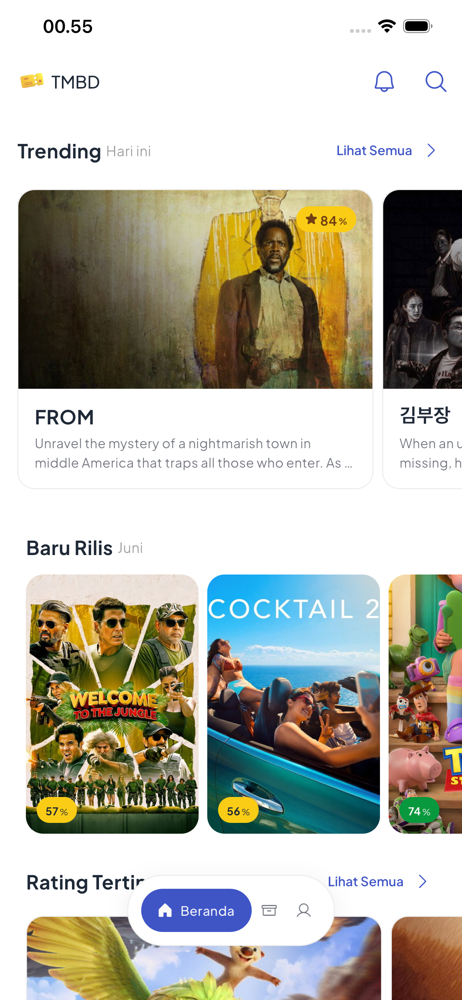
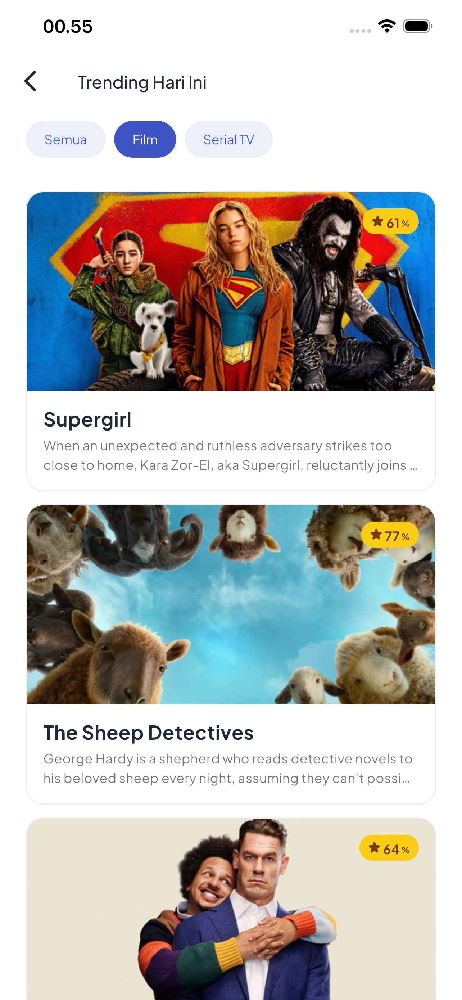
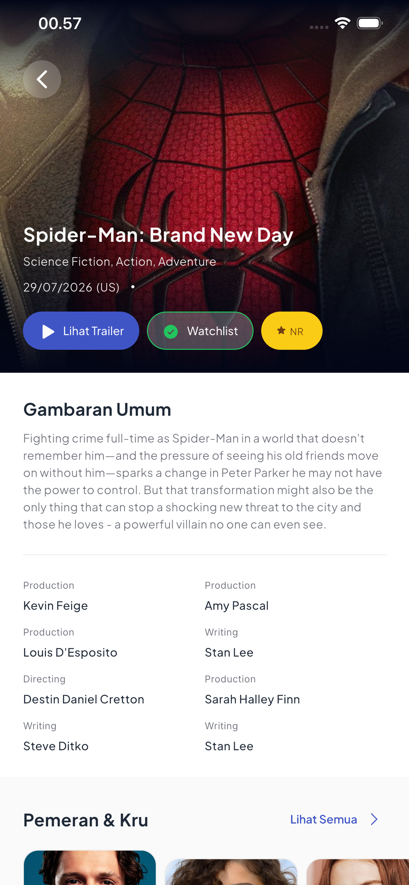
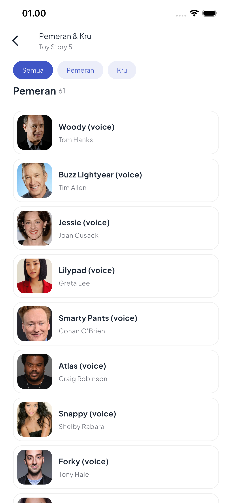
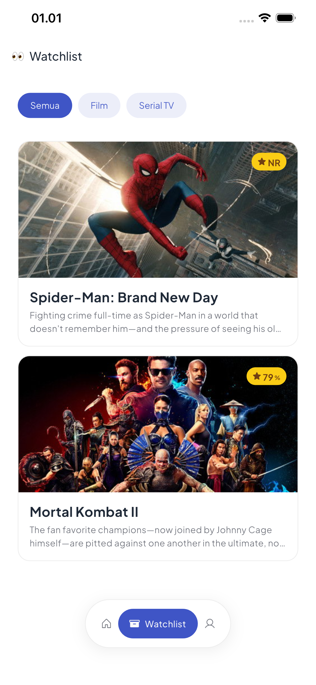
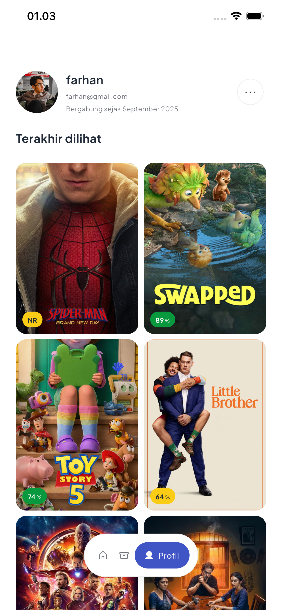

# NES Ticket

A modern mobile ticket management application built with Flutter, focusing on high performance, maintainability, and a scalable architecture.

## 🛠 Technical Specifications

- **Flutter SDK:** 3.44.4

## 🚀 Features

- **Reactive State Management** using `Riverpod`.
- **Offline Support** powered by `Hive Community Edition` for fast local data storage.
- **Robust Networking** with `Dio` for clean and efficient API communication.
- **Immutable Data Models** using `Freezed` and `json_serializable`.
- **Secure Storage** for sensitive data with `flutter_secure_storage`.
- **Type-safe Asset Management** using `flutter_gen`.

## 📦 Tech Stack

### Core

- **State Management:** `flutter_riverpod`, `riverpod_annotation`
- **Networking:** `dio`
- **Local Database:** `hive_ce`, `hive_ce_flutter`
- **Secure Storage:** `flutter_secure_storage`

### UI & Assets

- **Icons:** `phosphoricons_flutter`
- **Fonts:** `google_fonts`
- **Images:** `cached_network_image`, `flutter_svg`

### Development

- `build_runner`
- `riverpod_generator`
- `freezed`
- `flutter_gen_runner`

## 📱 Screenshots

<p align="center">
  
  
  
</p>

<p align="center">
  
  
  
</p>

<p align="center">
  
</p>

## 🛠 Development

This project uses **code generation**. Whenever you modify models, providers, or assets, run the following command:

```bash
dart run build_runner build --delete-conflicting-outputs
```